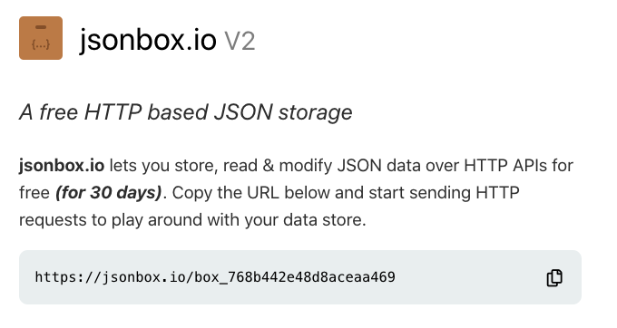

# Contact Manager Project
In this project, you will implement a client-side contact management application in JavaScript, and utilize a REST API to store contact information.


## Objectives
After completing this assignment, you will be able to ...
* Consume a RESTful web service by issuing asynchronous HTTP requests.
* Understand asynchronous programming in JavaScript.
* Respond to user generated UI events.
* Manipulate the DOM to create a single page application.

## Instructions
Implement a CRUD (Create, Read, Update Delete) contact list management application. The application must implement all stories (features) describe under the *User Stories* section. In summary, the features that must be implemented are as follows:
1. User adds a contact
2. User remvoves a contact
3. User searches for a contact
4. User edits a contact

After reviewing the *user stories* for required functionality, create a single-page, client-side JavaScript application in order to implement the features. You have creative freedom in implementing the user interface as long as it addresses all of the requirements in the user stories, is intuitive to use and requires only the initial page load (single-page application). All other page updates should be done via JavaScript and the DOM and not loaded from a server.

In order to persist the contact data for this application, you must utilize jsonbox.io (notes on API usage below) via asynchronous HTTP requests.

## User Stories (Features)
The follow stories (features) must be implemented.

### User searches for a contact
As a user, I want to search for a contact. I may search a contact by first and/or last name as well as by contact type. After I enter my search terms and/or contact type, I should be shown a list of contacts that match the criteria. The listing should show the following information for each contact ...

* Name (concatenated full name)
* Phone Number
* Email
* Birthday
* Age (calculated based on today's date, not stored)
* Notes
* Contact Type

I should also see a count of the contacts found. If no contacts are found, display an appropriate message.

In addition, I should be able to sort the contacts by last name.

I should be presented with the search screen upon first visiting the application.

### User adds a contact
As a user, I want to add a contact to my contact list. I first choose to add a contact, and am presented with a form to add the following contact information ...
* First Name - required
* Last Name - required
* Phone Number - required
* Contact Type (one of "Business", "Friend", or "Family") - required
* Notes (misc text for anyting you want to remember about this contact) - optional
* Email - required
* Birthday - optional

>Note, you should only store the above datapoints in jsonbox.io and nothing else.

After the contact is added, I should see a notification letting me know of my success. I should be shown the contact search listing afterwards with my newly added contact present (as long as current search filter allows for this contact to be shown). I should not be allowed to add a contact with invalid or missing (for required fields) data. If I attempt to do so, I should be shown information letting me know.

### User edits a contact
As a user, I want to edit one of my contacts. After finding the contact I want to edit and selecting them, I will be shown all the contact details in a form. After making my changes, I will save the contact. If required information is not provided, I should be notified. After editing the contact, I should be brought back to the contact search listing and a notification should be displayed letting me know I was successful.

### User removes a contact
As a user, I want to remove a contact. After I click the "remove" contact link next to the contact in question, it should be removed and not displayed anymore. After successfully removing a contact, I should be shown a notification.

## Requirements 
Your completed project should meet the following requirements ...
* Implements all the specified use cases.
* Utilizes jsonbox.io to store/retrieve contact data.
* Utilizes Bootstrap for styling.
* Utilizes the DOM to make all UI updates dynamically after the first page load.
* Provides an intuitive and clean user interface.
* Uses modules to organize code.

You will be evaluated on how well your implementation meets these requirements as well as the organization and logic of your code.

## jsonbox.io Notes
To get started, go to jsonbox.io. You should see something like this on the homepage ...



Copy the URL provided. This will be the base URL you will use when making a request to the API.

> Note: The box id (last part of the URL) will change everytime you visit this page. That's okay and this is by design. Keep one of the URLs you see and use this for all your calls.

For instructions on how to use the API, visit the docs page (off the homepage) or at [jsonbox.io documentation](https://github.com/vasanthv/jsonbox#readme)

For example, if I wanted to add a contact to my application under the *contacts* collection, I could make a call using axios ...

``` javascript
const contact = {
    firstName: 'Nicholas',
    lastName: 'Cage',
    //other fields described
};

axios.post('https://jsonbox.io/box_768b442e48d8aceaa469/contacts', contact).then(function(response) {
     //success logic
     }).catch(function(error) {
     //failure logice
});
```
You do not have to use axios, but I recommend that you do so.

## Webpack
A working configuration of webpack is included in this repository. While you are not required to use webpack, I recommend that you do. Note that this config seems only to work with Node 12.19.0 (LTS). If you do not have this installed, make sure to get nvm and follow the procedure we went over in class to have mutliple node verions installed on your computer.

Using this config with webpack, all of your css and javascript will be placed in public/build after webpack has run. You should code your JavaScript in `src/javascript/app.js`. Also, you can create modules here to. As long as they are included in `app.js`, they will be included in the final build. Code all your application SASS/CSS in `src/scss/app.scss`. If you need to override bootstrap, do this in `src/scss/bootstrap-overrides.scss`. Your html file is locationed in `public/index.html`.

In order to install dependencies with this config of webpack, run `npm install` in the root of the project. You may either build manually after your changes each time by running `npm run build` or have webpack build automatically after a change by running `npm run watch`.

## Submission
After you are finished with your implementation, push your changes to GitHub with the comment "Project Submission".
